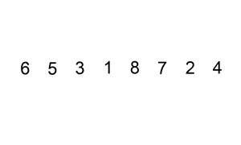

# 147. 对链表进行插入排序

  

---

## 题目描述

对链表进行插入排序。

插入排序的动画演示如上。从第一个元素开始，该链表可以被认为已经部分排序（用黑色表示）。  
每次迭代时，从输入数据中移除一个元素（用红色表示），并原地将其插入到已排好序的链表中。

 

**插入排序算法：**

1. 插入排序是迭代的，每次只移动一个元素，直到所有元素可以形成一个有序的输出列表。  
2. 每次迭代中，插入排序只从输入数据中移除一个待排序的元素，找到它在序列中适当的位置，并将其插入。  
3. 重复直到所有输入数据插入完为止。

**示例 1：**

&emsp;**输入:** `4->2->1->3`  
&emsp;**输出:** `1->2->3->4`

**示例 2：**

&emsp;**输入:** `-1->5->3->4->0`  
&emsp;**输出:** `-1->0->3->4->5`

> 来源：力扣（LeetCode）  
> 链接：https://leetcode-cn.com/problems/insertion-sort-list  
> 著作权归领扣网络所有。商业转载请联系官方授权，非商业转载请注明出处。  

---
